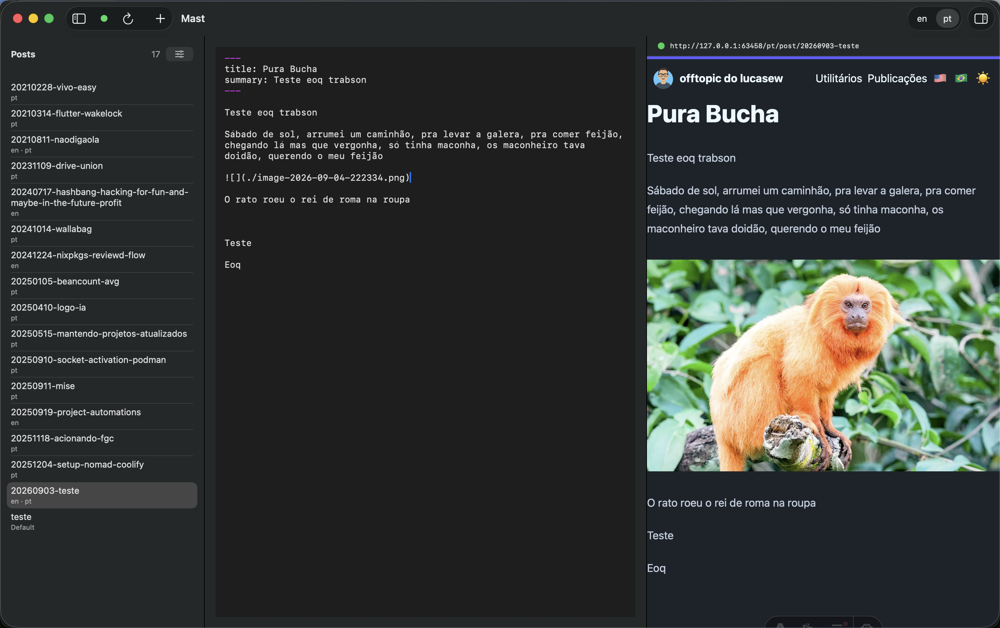
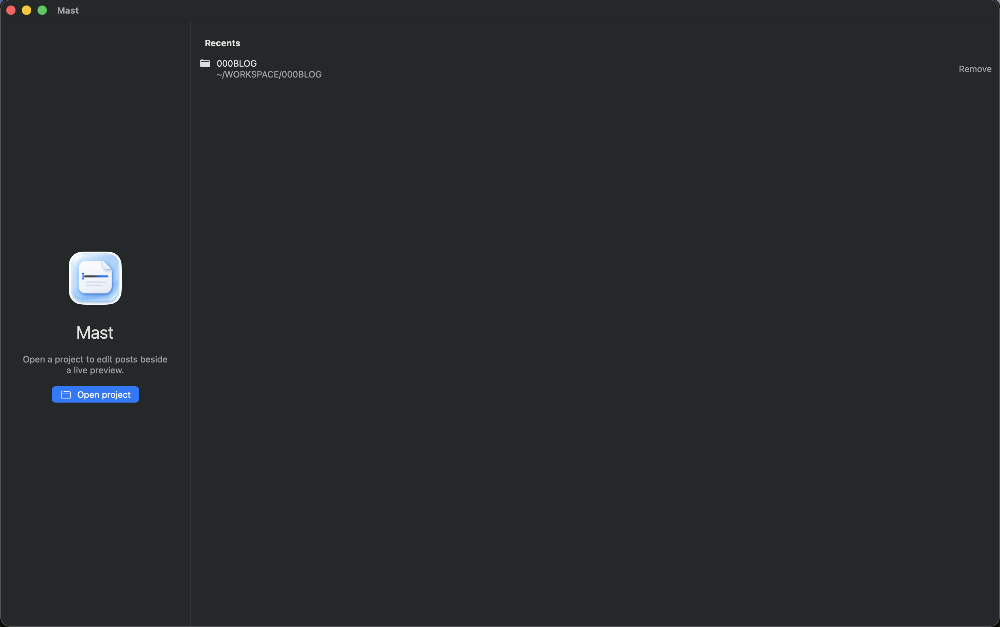

# Mast


Mast is a native macOS Markdown editor for blogs that build a site from local content files. It keeps the editor beside a live preview of the running site.





## Status

Mast is in design. The [v1 specification](SPEC.md) defines the planned project configuration, editor workflow, preview, presets, and image paste behavior.

## Build

You need Xcode and [mise](https://mise.jdx.dev/).

```bash
git clone https://github.com/lewtec/mast.git
cd mast
mise install
mise run
```

`mise run` builds and launches. `mise run generate` writes `Mast.xcodeproj`. `mise run test` runs the unit tests.

## Release

The public version is the git tag. `svu` picks the next tag. The Release build stamps that tag into `MARKETING_VERSION`. Do not commit a version bump.

Same operator API as the other lewtec repos:

1. GitHub → Actions → Autorelease → Run workflow
2. Pick `next`, `patch`, `minor`, or `major`
3. That runs `mise release $NEW_VERSION`: tag with `svu`, build a universal DMG, publish with GoReleaser

First release: pick **minor** (`0.1.0`). There are no tags yet, so `patch` would mint `0.0.1`.

Locally: `mise release minor`. A DMG without a GitHub release: `VERSION=0.1.0-dev mise package`.

The DMG is unsigned. First open: right-click Mast → Open.
